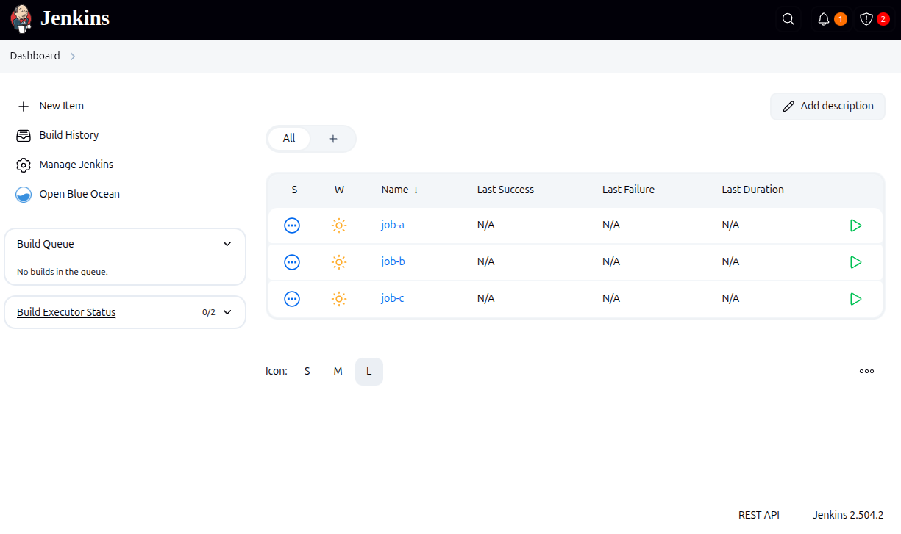

# Jenkins Docker Compose Setup

## Intro

This repository provides a Docker Compose setup for Jenkins. It allows you to quickly run Jenkins in a Docker container
using Docker Compose.

It's especially useful for experimentation and simple proof-of-concept (PoC) projects when developing Jenkins plugins.

## Features

* Supports running locally compiled Jenkins plugins in [.hpi](https://wiki.jenkins.io/display/JENKINS/Plugin+Structure)
  format
* Preconfigured with popular Jenkins plugins
* Includes sample jobs for demonstration

## Usage

### Starting Jenkins

To start Jenkins, run:

```bash
docker compose up
```

Then open your browser and go to: http://localhost:8080/

You should see Jenkins running:



### Adding Local Jenkins Plugins

Add or link [.hpi](https://wiki.jenkins.io/display/JENKINS/Plugin+Structure) file representing Jenkins Plugin under
folder [local-plugins](local-plugins).

## Author

Dominik Cebula

* https://dominikcebula.com/
* https://blog.dominikcebula.com/
* https://www.udemy.com/user/dominik-cebula/
